# Database Design — MeetASR

This document outlines the database design for storing meeting metadata, transcriptions, and LLM-generated meeting reports. The design supports **SQLite** for local development and **PostgreSQL** for production deployments.

---

## 1. Overall Architecture & Recommended Stack

- **ORM (Object-Relational Mapping):** **SQLModel** is highly recommended (built on top of SQLAlchemy and Pydantic). It allows defining database schemas and API validation models in a single place.
- **Migration Tool:** Use **Alembic** to manage database schema versions.
- **Database Engine:**
  - **Local Development:** SQLite (`sqlite:///meetasr.db`) for lightweight setup without external services.
  - **Production:** PostgreSQL for robust data integrity, concurrency, and high performance.

---

## 2. Entity-Relationship Diagram (ERD)

The database schema revolves around the central `meetings` entity.

```mermaid
erDiagram
    meetings ||--|| transcripts : "has 1-to-1"
    meetings ||--|| reports : "has 1-to-1"
    meetings ||--o{ sentences : "has 1-to-many"
    meetings ||--o{ topics : "has 1-to-many"
    meetings ||--o{ action_items : "has 1-to-many"
    meetings ||--o{ decisions : "has 1-to-many"

    meetings {
        string id PK "UUID or Unique String"
        string title "Meeting Name"
        float duration "Audio duration in seconds"
        string status "Status (pending | processing | completed | failed)"
        string language "Language (vi | en)"
        string audio_path "Path/URI to audio file"
        string asr_model "ASR model identifier"
        string llm_model "LLM model identifier"
        datetime created_at "Creation timestamp"
        datetime updated_at "Last update timestamp"
    }

    transcripts {
        string meeting_id PK, FK "Foreign Key to meetings.id"
        text text "Complete transcribed text"
        float duration "Actual transcription duration"
        string language "Language"
    }

    sentences {
        int id PK "Autoincrement"
        string meeting_id FK "Foreign Key to meetings.id"
        text text "Sentence text content"
        float start "Start time (seconds)"
        float end "End time (seconds)"
        int speaker "Speaker ID (Nullable)"
        text char_timestamps "JSON array of [[start_ms, end_ms], ...]"
    }

    reports {
        string meeting_id PK, FK "Foreign Key to meetings.id"
        text summary "Meeting summary in Markdown"
        float processing_time "LLM analysis time in seconds"
        datetime created_at "Report creation timestamp"
    }

    topics {
        int id PK "Autoincrement"
        string meeting_id FK "Foreign Key to meetings.id"
        string title "Topic title"
        text description "Detailed discussion description"
        float start_time "Start time (seconds)"
        float end_time "End time (seconds)"
    }

    action_items {
        int id PK "Autoincrement"
        string meeting_id FK "Foreign Key to meetings.id"
        text task "Task description"
        string assignee "Assignee name (Nullable)"
        string deadline "Deadline description (Nullable)"
        string priority "Priority level (high | medium | low)"
        string mentioned_by "Who assigned the task (Nullable)"
        float timestamp "Time mentioned in audio (seconds, Nullable)"
    }

    decisions {
        int id PK "Autoincrement"
        string meeting_id FK "Foreign Key to meetings.id"
        text content "Decision details"
        string made_by "Person or group who made the decision"
        float timestamp "Time decided in audio (seconds, Nullable)"
    }
```



---

## 3. Table Schema Specifications

### 3.1 The `meetings` Table
Stores metadata for each meeting processing session.

| Column | Data Type | Constraints | Description |
| :--- | :--- | :--- | :--- |
| `id` | VARCHAR(36) | PRIMARY KEY | Unique identifier (UUID) |
| `title` | VARCHAR(255) | NOT NULL | Meeting title (e.g., filename or user-defined) |
| `duration` | FLOAT | DEFAULT 0.0 | Total audio duration (seconds) |
| `status` | VARCHAR(20) | NOT NULL | State: `'pending'`, `'processing'`, `'completed'`, `'failed'` |
| `language` | VARCHAR(10) | DEFAULT 'vi' | Primary spoken language |
| `audio_path` | VARCHAR(512) | NOT NULL | Physical file path or URI of the input audio |
| `asr_model` | VARCHAR(100) | NULL | ASR model used (e.g., `iic/SenseVoiceSmall`) |
| `llm_model` | VARCHAR(100) | NULL | LLM model used (e.g., `gpt-4o-mini`, `qwen2.5`) |
| `created_at` | DATETIME | DEFAULT CURRENT_TIMESTAMP | Upload and session creation timestamp |
| `updated_at` | DATETIME | DEFAULT CURRENT_TIMESTAMP | Last status update timestamp |

### 3.2 The `transcripts` Table
Stores aggregated transcription results. **1-to-1** relationship with `meetings`.

| Column | Data Type | Constraints | Description |
| :--- | :--- | :--- | :--- |
| `meeting_id` | VARCHAR(36) | PRIMARY KEY, FK | Foreign Key references `meetings.id` (ON DELETE CASCADE) |
| `text` | TEXT | NOT NULL | Combined transcribed text |
| `duration` | FLOAT | NOT NULL | Actual transcribed duration (seconds) |
| `language` | VARCHAR(10) | NOT NULL | Detected or specified language |

### 3.3 The `sentences` Table
Stores sentence breakdown with speaker tags and character-level timestamps. **1-to-many** relationship with `meetings`.

| Column | Data Type | Constraints | Description |
| :--- | :--- | :--- | :--- |
| `id` | INTEGER | PRIMARY KEY, AUTOINCREMENT | Autoincremented ID |
| `meeting_id` | VARCHAR(36) | FK | Foreign Key references `meetings.id` (ON DELETE CASCADE) |
| `text` | TEXT | NOT NULL | Text of the sentence |
| `start` | FLOAT | NOT NULL | Start timestamp (seconds) |
| `end` | FLOAT | NOT NULL | End timestamp (seconds) |
| `speaker` | INTEGER | NULL | Speaker identifier (populated by Diarization module) |
| `char_timestamps` | TEXT | NULL | JSON string storing timestamps of individual characters |

> [!NOTE]
> Since SQLite lacks native JSON types, `char_timestamps` is stored as a serialized JSON string (e.g., `[[10, 80], [90, 150]]`). The ORM handles serialization and deserialization automatically.

### 3.4 The `reports` Table
Stores LLM-generated summaries. **1-to-1** relationship with `meetings`.

| Column | Data Type | Constraints | Description |
| :--- | :--- | :--- | :--- |
| `meeting_id` | VARCHAR(36) | PRIMARY KEY, FK | Foreign Key references `meetings.id` (ON DELETE CASCADE) |
| `summary` | TEXT | NOT NULL | Meeting summary in Markdown |
| `processing_time` | FLOAT | NOT NULL | Time taken by LLM to analyze (seconds) |
| `created_at` | DATETIME | DEFAULT CURRENT_TIMESTAMP | Report generation timestamp |

### 3.5 The `topics` Table
Stores topics discussed in the meeting. **1-to-many** relationship with `meetings`.

| Column | Data Type | Constraints | Description |
| :--- | :--- | :--- | :--- |
| `id` | INTEGER | PRIMARY KEY, AUTOINCREMENT | Autoincremented ID |
| `meeting_id` | VARCHAR(36) | FK | Foreign Key references `meetings.id` (ON DELETE CASCADE) |
| `title` | VARCHAR(255) | NOT NULL | Topic name |
| `description` | TEXT | NOT NULL | Description of points discussed under this topic |
| `start_time` | FLOAT | NOT NULL | Topic start timestamp (seconds) |
| `end_time` | FLOAT | NOT NULL | Topic end timestamp (seconds) |

### 3.6 The `action_items` Table
Stores actionable items assigned during the meeting. **1-to-many** relationship with `meetings`.

| Column | Data Type | Constraints | Description |
| :--- | :--- | :--- | :--- |
| `id` | INTEGER | PRIMARY KEY, AUTOINCREMENT | Autoincremented ID |
| `meeting_id` | VARCHAR(36) | FK | Foreign Key references `meetings.id` (ON DELETE CASCADE) |
| `task` | TEXT | NOT NULL | Task description |
| `assignee` | VARCHAR(100) | NULL | Person assigned (nullable) |
| `deadline` | VARCHAR(100) | NULL | Deadline description (nullable) |
| `priority` | VARCHAR(20) | DEFAULT 'medium' | Priority level: `'high'`, `'medium'`, `'low'` |
| `mentioned_by` | VARCHAR(100) | NULL | Speaker who mentioned/assigned the task |
| `timestamp` | FLOAT | NULL | Time mentioned in the audio (seconds) |

### 3.7 The `decisions` Table
Stores official agreements reached. **1-to-many** relationship with `meetings`.

| Column | Data Type | Constraints | Description |
| :--- | :--- | :--- | :--- |
| `id` | INTEGER | PRIMARY KEY, AUTOINCREMENT | Autoincremented ID |
| `meeting_id` | VARCHAR(36) | FK | Foreign Key references `meetings.id` (ON DELETE CASCADE) |
| `content` | TEXT | NOT NULL | Decision details |
| `made_by` | VARCHAR(100) | DEFAULT 'Team' | Decision maker (person or group) |
| `timestamp` | FLOAT | NULL | Time decided in the audio (seconds) |

---

## 4. Proposed Database Directory Structure (`meetasr/db/`)

The Data Engineer should organize the database package structure as follows:

```
meetasr/db/
├── __init__.py          # Session factory initialization & get_db helper
├── connection.py        # SQLite/PostgreSQL engine and sessionmaker config
├── models.py            # SQLModel/SQLAlchemy class declarations
└── repository.py        # CRUD utilities for reading and writing data
```

### Example Model Declaration (`meetasr/db/models.py`)

```python
from datetime import datetime
from typing import Optional, List
from sqlmodel import SQLModel, Field, Relationship

class Meeting(SQLModel, table=True):
    __tablename__ = "meetings"

    id: str = Field(primary_key=True)
    title: str
    duration: float = 0.0
    status: str = Field(default="pending")
    language: str = "vi"
    audio_path: str
    asr_model: Optional[str] = None
    llm_model: Optional[str] = None
    created_at: datetime = Field(default_factory=datetime.utcnow)
    updated_at: datetime = Field(default_factory=datetime.utcnow)

    # Relationships
    transcript: Optional["Transcript"] = Relationship(
        back_populates="meeting", 
        sa_relationship_kwargs={"uselist": False, "cascade": "all, delete-orphan"}
    )
    report: Optional["Report"] = Relationship(
        back_populates="meeting", 
        sa_relationship_kwargs={"uselist": False, "cascade": "all, delete-orphan"}
    )
    sentences: List["Sentence"] = Relationship(
        back_populates="meeting", 
        sa_relationship_kwargs={"cascade": "all, delete-orphan"}
    )
    topics: List["TopicModel"] = Relationship(
        back_populates="meeting", 
        sa_relationship_kwargs={"cascade": "all, delete-orphan"}
    )
    action_items: List["ActionItemModel"] = Relationship(
        back_populates="meeting", 
        sa_relationship_kwargs={"cascade": "all, delete-orphan"}
    )
    decisions: List["DecisionModel"] = Relationship(
        back_populates="meeting", 
        sa_relationship_kwargs={"cascade": "all, delete-orphan"}
    )
```

> [!TIP]
> Setting `cascade="all, delete-orphan"` ensures that when a meeting is deleted, all related transcripts, sentences, reports, action items, and decisions are automatically purged from the database, preventing orphaned data records.
