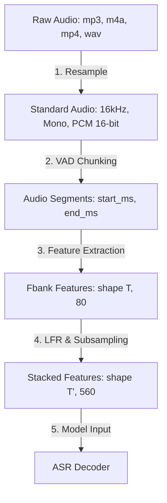

# Data Processing Pipeline & Dataset Loader — MeetASR

This document details the audio processing workflow and Dataset Loader designs for MeetASR, aligned with the data handling patterns established in **FunASR** (ModelScope).

---

## 1. Input Data Formats

For large-scale speech processing, loading thousands of audio files directly into memory is not feasible. FunASR utilizes two primary formats to index and reference audio datasets: **SCP (Script File)** and **JSONL (JSON Lines)**.

### 1.1 SCP Format (Kaldi-style)
The SCP format uses plain text files to map a unique identifier (`key`) to the path of the corresponding audio or text file.

- **`wav.scp`**: Maps segment IDs to their audio file paths.
  ```text
  meeting_001_seg01 /data/audio/meeting_001_0_15.wav
  meeting_001_seg02 /data/audio/meeting_001_15_32.wav
  meeting_002_seg01 /data/audio/meeting_002_0_8.wav
  ```
- **`text`**: Maps segment IDs to their transcriptions.
  ```text
  meeting_001_seg01 HELLO EVERYONE WELCOME TO THE MEETING
  meeting_001_seg02 TODAY WE WILL DISCUSS PROJECT PROGRESS
  meeting_002_seg01 HI TEAM
  ```
- **`utt2spk`** (Utterance to Speaker mapping):
  ```text
  meeting_001_seg01 speaker_1
  meeting_001_seg02 speaker_2
  ```

### 1.2 JSONL Format
JSONL is a more modern format, grouping all metadata associated with a single training/inference sample into a single line containing a valid JSON object.

```json
{"key": "meeting_001_seg01", "source": "/data/audio/meeting_001_0_15.wav", "target": "HELLO EVERYONE WELCOME TO THE MEETING", "speaker": 1}
{"key": "meeting_001_seg02", "source": "/data/audio/meeting_001_15_32.wav", "target": "TODAY WE WILL DISCUSS PROJECT PROGRESS", "speaker": 2}
```

---

## 2. Audio Processing Pipeline

Upon receiving an input meeting audio file, it undergoes a sequential processing pipeline:



### 2.1 Audio Normalization (Resampling)
All VAD and ASR models (SenseVoice, Paraformer) in FunASR are trained on audio sampled at **16kHz** with a single channel (**mono**). Raw audio must be standardized accordingly.
- Recommended libraries: `torchaudio` or `soundfile` in combination with `librosa`.
- Code implementation is located in: `meetasr/utils/audio.py` (the `load_audio` function).

### 2.2 Voice Activity Detection (VAD Chunking)
Meeting audio files are often long (minutes to hours). Feeding long audio clips directly into ASR models causes GPU Out of Memory (OOM) errors.
- Use a VAD model (`fsmn-vad`) to detect silence and segment the audio into smaller chunks (ideally between 10s and 30s).
- The VAD output is a list of timestamps: `[[start_ms, end_ms], ...]`.

### 2.3 Fbank Feature Extraction & LFR Stacking
Instead of raw waveforms, ASR models in FunASR expect Log-Mel Filter Bank (Fbank) features as input.
- **Fbank Extraction**: Computes spectrogram representation with 80 Mel filters, yielding a feature matrix of shape $[T, 80]$ where $T$ is the number of time frames.
- **LFR (Low Frame Rate)**: Stacks $N$ adjacent frames (typically 7 frames: 3 preceding, 1 current, 3 succeeding) to reduce time resolution, speeding up model computation. The resulting shape is $[T', 80 \times 7] = [T', 560]$, where $T' \approx T/6$.
- Reference code: `meetasr/frontends/fbank.py`.

---

## 3. Dataset Loader Design in MeetASR

For offline batch inference or training, the Data Engineer should design a PyTorch-compatible dataset loader extending `torch.utils.data.Dataset`.

### 3.1 Script File Loader (`meetasr/datasets/scp_dataset.py`)

```python
import torch
from torch.utils.data import Dataset
from meetasr.utils.audio import load_audio
from meetasr.frontends.fbank import WavFrontend

class SCPDataset(Dataset):
    """Dataset loader reading from a wav.scp file aligned with FunASR's implementation."""

    def __init__(self, scp_path: str, frontend: WavFrontend = None):
        self.data = []
        self.frontend = frontend
        
        # Parse scp file
        with open(scp_path, "r", encoding="utf-8") as f:
            for line in f:
                line = line.strip()
                if not line:
                    continue
                parts = line.split(maxsplit=1)
                if len(parts) == 2:
                    self.data.append({"key": parts[0], "path": parts[1]})

    def __len__(self) -> int:
        return len(self.data)

    def __getitem__(self, idx: int) -> dict:
        item = self.data[idx]
        key = item["key"]
        path = item["path"]
        
        # 1. Load raw audio (resampled to 16kHz)
        waveform, sample_rate = load_audio(path)
        
        # 2. Extract Fbank features if frontend is provided
        if self.frontend is not None:
            features = self.frontend.extract_fbank(waveform)
            return {"key": key, "speech": features}
            
        return {"key": key, "speech": waveform, "sample_rate": sample_rate}
```

### 3.2 Dataset Collate Function
Since segments have varying durations, their extracted feature matrices have different lengths $T$. A custom collate function pads features with zeros to group them into a single tensor batch.

```python
def collate_fn_speech(batch: list[dict]) -> dict:
    """Collate samples of varying lengths into a padded batch."""
    keys = [item["key"] for item in batch]
    speeches = [torch.tensor(item["speech"]) for item in batch]
    
    # Retrieve raw sequence lengths before padding
    lengths = torch.tensor([s.size(0) for s in speeches], dtype=torch.int32)
    
    # Pad sequences with 0.0
    padded_speeches = torch.nn.utils.rnn.pad_sequence(
        speeches, batch_first=True, padding_value=0.0
    )
    
    return {
        "keys": keys,
        "speech": padded_speeches,         # Tensor shape: [Batch_Size, Max_T, Feature_Dim]
        "speech_lengths": lengths          # Raw sequence lengths
    }
```

---

## 4. Specific Data Engineer Tasks for the Data Pipeline

1. **Standardize Audio Utilities (`meetasr/utils/audio.py`)**: Ensure proper decoding of compressed formats (`.mp3`, `.m4a`, etc.) and automatic downsampling to 16kHz mono.
2. **Build Dataset Loaders (`meetasr/datasets/`)**:
   - Implement SCP and JSONL parser helpers.
   - Implement `SCPDataset` and `JSONLDataset` classes.
   - Implement optimized collate functions to support multi-process loading (`num_workers > 0` in `torch.utils.data.DataLoader`).
3. **Write Batch Preprocessing Script**:
   - Build a command-line script that scans an audio directory, registers files, and generates a formatted `wav.scp` file for batch transcription pipelines.
